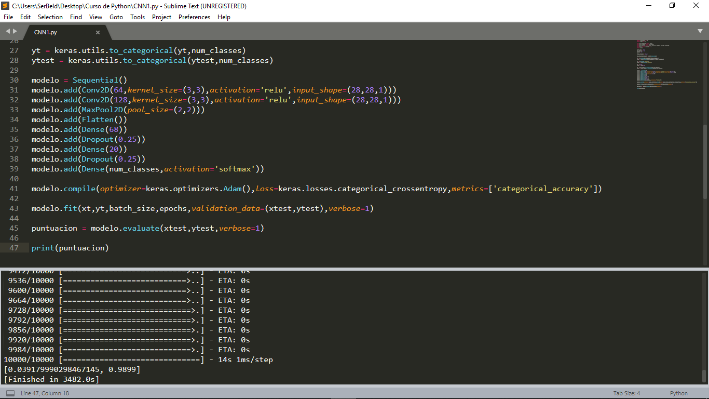

# Tensorflow
Este repositorio está orientado a realizar prácticas del curso de redes neuronales convolucionales usando Tensorflow

# Descargar Requerimientos en Windows
Copie y pegue cada una de los siguientes comandos en el CMD (Símbolo del sistema) ingresando los comandos línea por línea solo una a la vez:

python -m pip install -U pip

python -m pip install --upgrade pip

pip install opencv-python

pip install tensorflow

pip install keras

####
# Descargar Requerimientos en Ubuntu
Copie y pegue cada una de los siguientes comandos en el terminal ingresando los comandos línea por línea solo una a la vez:

### Python 3

sudo apt-get install python3-pip

pip3 install --user opencv-python

pip3 install --user tensorflow

pip3 install --user keras

####

####  Sergio Beleño :octocat: ✒️
